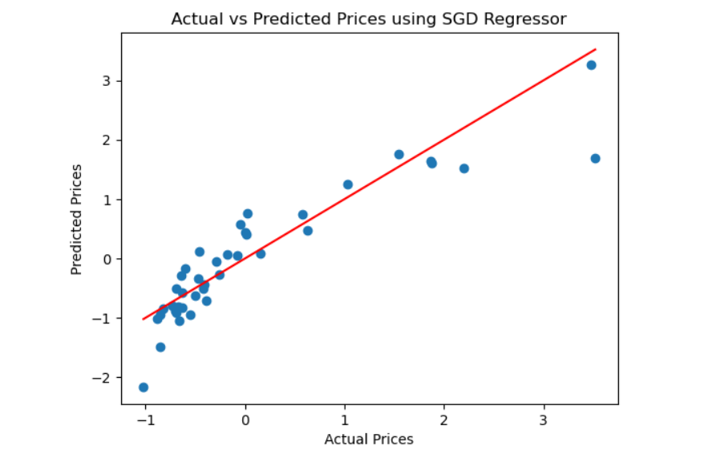

# BLENDED_LEARNING
# Implementation-of-Stochastic-Gradient-Descent-SGD-Regressor

## AIM:
To write a program to implement Stochastic Gradient Descent (SGD) Regressor for linear regression and evaluate its performance.

## Equipments Required:
1. Hardware – PCs
2. Anaconda – Python 3.7 Installation / Jupyter notebook

## Algorithm
1. Import libraries, load the dataset, remove unwanted columns, and encode categorical features.
2.Separate features and target, standardize the data, and split into training and testing sets.
3.Create the SGD Regressor model, train it using the training data, and make predictions.
4.Evaluate using MSE, MAE, R² and plot actual vs predicted values.

## Program:
```
/*
Program to implement SGD Regressor for linear regression.
Developed by: KOPIGA.N
RegisterNumber:  212225220053
*/
```
```
import pandas as pd
import numpy as np
import matplotlib.pyplot as plt
from sklearn.model_selection import train_test_split
from sklearn.linear_model import SGDRegressor 
from sklearn.metrics import mean_squared_error,mean_absolute_error, r2_score 
from sklearn.preprocessing import StandardScaler
# Load the dataset
data = pd.read_csv("CarPrice_Assignment (1) (1).csv")
print(data.head())
print(data.info())
# Data preprocessing
# Dropping unnecessary colunms and handling categorical variables
data =  data.drop(['CarName', 'car_ID'], axis=1)
data =  pd.get_dummies(data, drop_first=True)
# Splitting the data info features and target variables
X = data.drop('price', axis=1)
y = data['price']
# Standardizing the data
scaler = StandardScaler()
X = scaler.fit_transform(X)
y = scaler.fit_transform(np.array(y).reshape(-1, 1))
# Splitting the dataset into training and testing sets
X_train, X_test, y_train, y_test = train_test_split(X, y, test_size=0.2, random_state=42)
# Creating the SGD Regressor model
sgd_model = SGDRegressor(max_iter=1000, tol=1e-3)
# Fitting the model on the training data
sgd_model.fit(X_train, y_train)
# Making predictions
y_pred = sgd_model.predict(X_test)
# Evaluating model performance
mse = mean_squared_error(y_test, y_pred)
print(f"MSE: {mean_squared_error(y_test, y_pred):.2f}")
print(f"MAE: {mean_absolute_error(y_test, y_pred):.2f}")
print(f"R²: {r2_score(y_test, y_pred):.4f}")
print('Name: KOPIGA.N')
print('Reg No:212225220053')
print(f"MSE: {mse:.4f}")
print(f"R^2: {r2_score(y_test,y_pred):.4f}")
print(f"MAE: {mean_absolute_error(y_test,y_pred):.4f}")
print("\nModel Coefficients:")
print("Coefficiens:",sgd_model.coef_)
print("Intercept:",sgd_model.intercept_)
plt.scatter(y_test, y_pred)
plt.xlabel("Actual Prices")
plt.ylabel("Predicted Prices")
plt.title("Actual vs Predicted Prices using SGD Regressor")
plt.plot([min(y_test), max(y_test)], [min(y_test), max(y_test)], color='red') 
plt.show()
```
## Output:




## Result:
Thus, the implementation of Stochastic Gradient Descent (SGD) Regressor for linear regression has been successfully demonstrated and verified using Python programming.
